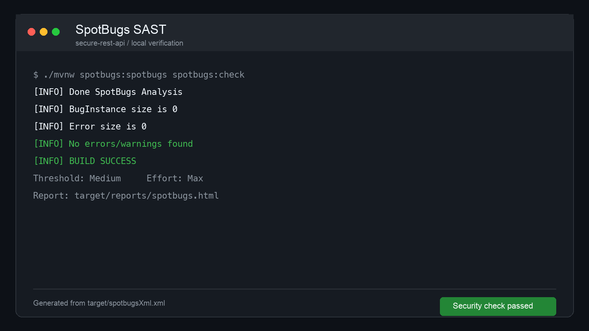
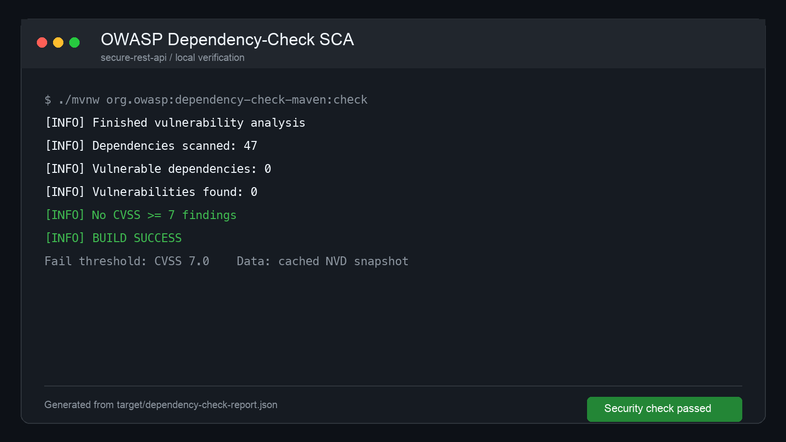
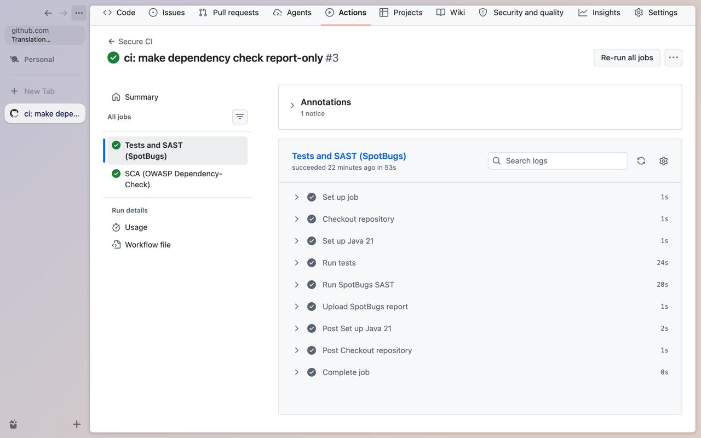
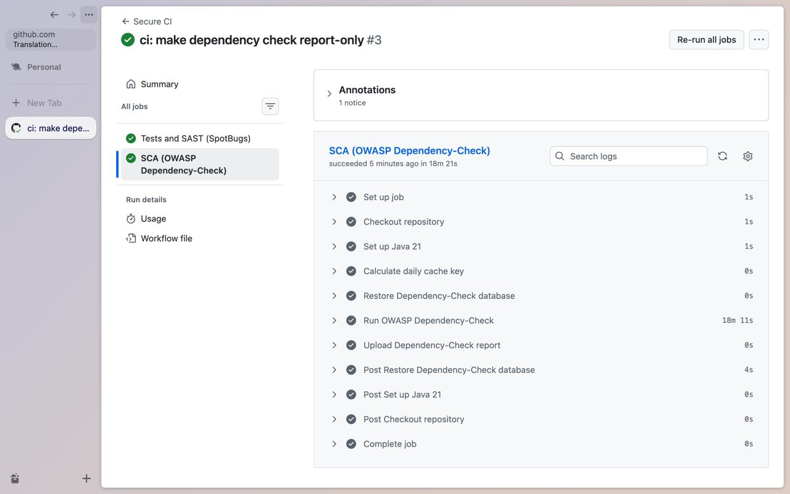
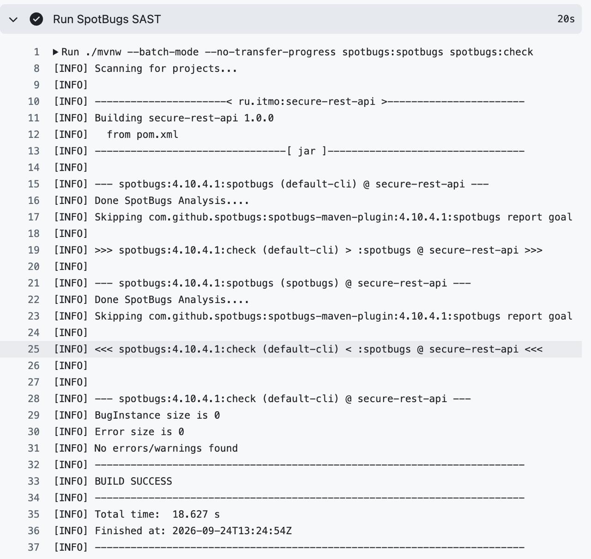

# Защищённый REST API на Java/Spring Boot

Лабораторная работа № 1 по дисциплине «Информационная безопасность». Проект демонстрирует REST API с JWT-аутентификацией, хранением паролей в виде BCrypt-хешей, защитой от SQL-инъекций и XSS, а также автоматическими SAST/SCA-проверками в GitHub Actions.

## Стек

- Java 21, Spring Boot 3.5.16;
- Spring Web, Spring Security, Spring Data JPA;
- H2 в файловом режиме;
- JJWT 0.13.0, BCrypt;
- JUnit 5 и MockMvc;
- SpotBugs (SAST), OWASP Dependency-Check (SCA);
- Maven Wrapper, GitHub Actions.

Версия Log4j BOM принудительно обновлена до 2.26.1: первый SCA-прогон обнаружил CVE-2026-34477 и CVE-2026-34479 в управляемой Spring Boot версии 2.24.3, после чего зависимость была исправлена.

## Запуск

Требуется JDK 21. Maven устанавливать не нужно: проект содержит Maven Wrapper.

```bash
export JWT_SECRET="$(openssl rand -base64 32)"
export APP_DEFAULT_PASSWORD="StrongPassword123!"
export APP_DEFAULT_USERNAME="student"
export DB_PASSWORD="LocalDatabasePassword123!"
./mvnw spring-boot:run
```

Приложение доступно по адресу `http://localhost:8080`. База создаётся в каталоге `data/`, который исключён из Git. Секрет JWT, пароль пользователя и пароль БД не хранятся в репозитории и передаются через переменные окружения.

## API

### POST `/auth/login`

Публичный метод аутентификации. Принимает логин и пароль, возвращает подписанный JWT сроком на 15 минут.

```bash
curl -s -X POST http://localhost:8080/auth/login \
  -H 'Content-Type: application/json' \
  -d '{"username":"student","password":"StrongPassword123!"}'
```

Пример ответа:

```json
{
  "token": "eyJhbGciOiJIUzI1NiJ9...",
  "tokenType": "Bearer",
  "expiresInSeconds": 900
}
```

Для удобства дальнейших команд можно сохранить токен:

```bash
TOKEN=$(curl -s -X POST http://localhost:8080/auth/login \
  -H 'Content-Type: application/json' \
  -d '{"username":"student","password":"StrongPassword123!"}' | \
  python3 -c 'import json,sys; print(json.load(sys.stdin)["token"])')
```

### GET `/api/data`

Возвращает список записей. Требует заголовок `Authorization: Bearer <token>`.

```bash
curl -i http://localhost:8080/api/data \
  -H "Authorization: Bearer $TOKEN"
```

Без токена сервер возвращает `401 Unauthorized`:

```bash
curl -i http://localhost:8080/api/data
```

### POST `/api/data`

Создаёт запись от имени аутентифицированного пользователя. Это третий метод API, придуманный в рамках задания.

```bash
curl -i -X POST http://localhost:8080/api/data \
  -H "Authorization: Bearer $TOKEN" \
  -H 'Content-Type: application/json' \
  -d '{"title":"Новая запись","content":"Содержимое записи"}'
```

Успешный ответ имеет статус `201 Created`. Поля `title` и `content` ограничены по длине и проверяются Bean Validation.

## Реализованные меры защиты

### Защита от SQL-инъекций

Доступ к БД выполняется через Spring Data JPA. Методы `findByUsername` и `findAllByOrderByCreatedAtDesc` формируют параметризованные запросы; пользовательский ввод не объединяется со строкой SQL. Интеграционный тест отправляет логин `' OR '1'='1` и подтверждает, что аутентификация заканчивается `401`.

### Защита от XSS

Пользовательские поля экранируются методом `HtmlUtils.htmlEscape` при формировании каждого `DataResponse`. Поэтому, например, `<script>` возвращается как `&lt;script&gt;` и не может быть интерпретирован браузером как HTML. Дополнительно:

- ответы имеют тип `application/json`;
- Spring Security добавляет `X-Content-Type-Options: nosniff`;
- задан CSP `default-src 'none'; frame-ancestors 'none'`;
- входные данные валидируются и ограничиваются по длине.

Интеграционный тест создаёт запись с `<script>` и проверяет отсутствие неэкранированного тега в ответе.

### Защита аутентификации и доступа

- Пароли хранятся только как адаптивные BCrypt-хеши с cost factor 12. Открытый пароль используется только во время первоначального создания учебной учётной записи и поступает из переменной окружения.
- После успешной проверки пароля сервер выдаёт JWT, подписанный HMAC-SHA-256. Токен содержит `sub` (имя пользователя), `iss`, `iat` и `exp`; срок действия — 15 минут.
- `JwtAuthenticationFilter` проверяет подпись, издателя, срок действия и наличие пользователя перед заполнением `SecurityContext`.
- Приложение не создаёт HTTP-сессий (`STATELESS`). Все методы, кроме `/auth/login`, требуют аутентификацию.
- Отсутствующий, повреждённый или просроченный токен приводит к ответу `401` в JSON, без раскрытия внутренних исключений.
- Секрет подписи не закоммичен: `JWT_SECRET` должен содержать не менее 256 бит энтропии в Base64.

### Дополнительные меры

- CSRF отключён осознанно: API не использует cookie-аутентификацию, а токен передаётся в заголовке Authorization.
- Включены защитные HTTP-заголовки Spring Security; показ стек-трейсов клиенту отключён.
- Ограничения Bean Validation снижают риск избыточных входных данных.
- Репозиторий не содержит секретов, локальной БД и сборочных артефактов.
- Maven Wrapper проверяет SHA-256 архива Maven, а `setup-java` проверяет подпись дистрибутива JDK в CI.

## Тестирование

```bash
./mvnw clean test
```

Набор MockMvc-тестов проверяет:

1. успешную выдачу JWT;
2. запрет доступа без токена;
3. доступ с корректным JWT;
4. невозможность SQLi-обхода входа;
5. экранирование XSS-нагрузки;
6. хранение только BCrypt-хеша пароля;
7. отклонение повреждённого JWT;
8. валидацию слишком длинных данных.

## CI/CD и анализ безопасности

Workflow `.github/workflows/ci.yml` запускается при каждом `push` и `pull_request` и содержит два независимых задания:

1. `Tests and SAST (SpotBugs)` — сборка, тесты, статический анализ байткода и публикация HTML/XML-отчёта.
2. `SCA (OWASP Dependency-Check)` — поиск известных CVE в зависимостях и публикация HTML/JSON-отчёта. Проверка работает в отчётном режиме (`failBuildOnCVSS=11`): найденные записи не скрываются, но сборка не блокируется из-за CVE, относящихся к необязательным функциям или требующих обновлений, доступных только в enterprise-ветках Spring.

Публичный репозиторий: [github.com/weebatt/secure-rest-api-lab1](https://github.com/weebatt/secure-rest-api-lab1). Последний успешный запуск pipeline: [Secure CI #3](https://github.com/weebatt/secure-rest-api-lab1/actions/runs/36005325041).

Для SCA кэшируется локальная база Dependency-Check. Перед первым запуском в `Settings → Secrets and variables → Actions` необходимо добавить repository secret `NVD_API_KEY`, полученный на сайте NVD. Workflow намеренно завершится с понятной ошибкой, если секрет отсутствует: так неполное обновление базы нельзя ошибочно принять за успешный аудит. Сам ключ передаётся плагину через имя переменной окружения и не появляется в командной строке.

Локальный запуск проверок:

```bash
./mvnw clean verify -Ddependency-check.skip=true
./mvnw spotbugs:spotbugs spotbugs:check
./mvnw org.owasp:dependency-check-maven:check
```

### Отчёты сканеров

Ниже приведены снимки фактических локальных отчётов и успешного запуска GitHub Actions. Исходные файлы доступны в [SpotBugs HTML](report/docs/reports/spotbugs.html) и [Dependency-Check HTML](report/docs/reports/dependency-check-report.html).











## Контрольные вопросы

### 1. Почему BCrypt предпочтительнее SHA-256 для паролей?

SHA-256 специально спроектирован как быстрый универсальный хеш. Злоумышленник может проверять миллиарды вариантов пароля в секунду на GPU/ASIC. BCrypt является медленной password hashing function: он автоматически использует уникальную соль и имеет настраиваемую стоимость, которую можно повышать по мере роста мощности оборудования. Поэтому массовый перебор существенно дороже. SHA-256 допустим для контроля целостности, но не для самостоятельного хранения паролей.

### 2. В чём разница между SAST и DAST?

SAST анализирует исходный код или байткод без запуска приложения и находит опасные конструкции на ранних стадиях разработки. DAST проверяет уже работающее приложение снаружи, посылая запросы и наблюдая ответы; исходный код ему не нужен. SAST лучше показывает место дефекта в коде, но может давать ложные срабатывания. DAST видит фактически доступные во время запуска проблемы, но хуже локализует причину и не покрывает неактивированные ветви. Подходы дополняют друг друга.

### 3. Как работает JWT?

JWT состоит из Base64URL-кодированных Header, Payload и Signature. Header указывает тип токена и алгоритм подписи. Payload содержит claims: в этом проекте `sub`, `iss`, `iat`, `exp`. Сервер подписывает первые две части секретным ключом HMAC-SHA-256. При запросе middleware заново вычисляет подпись и сравнивает её с Signature, затем проверяет издателя и срок действия. Payload не шифруется, поэтому в JWT нельзя помещать пароли и другие секреты.

### 4. Чем опасно отсутствие аудита зависимостей?

Сторонняя библиотека выполняется с правами приложения и может содержать известную уязвимость, вредоносный код или уязвимые транзитивные зависимости. Без SCA команда может годами использовать CVE, для которой уже опубликован эксплойт и исправление. Дополнительные риски — supply-chain атаки, захват имени пакета, неподдерживаемые версии и несовместимые лицензии. Автоматический аудит делает такие проблемы видимыми при каждом изменении зависимостей.

## Ссылки

- [OWASP Top 10](https://owasp.org/www-project-top-ten/)
- [OWASP Cheat Sheet Series](https://cheatsheetseries.owasp.org/)
- [JWT Introduction](https://www.jwt.io/introduction)
- [Spring Security Reference](https://docs.spring.io/spring-security/reference/)
- [GitHub Actions Documentation](https://docs.github.com/actions)
- [OWASP Dependency-Check](https://dependency-check.github.io/DependencyCheck/)
- [Apache Logging Services Security](https://logging.apache.org/security.html)
